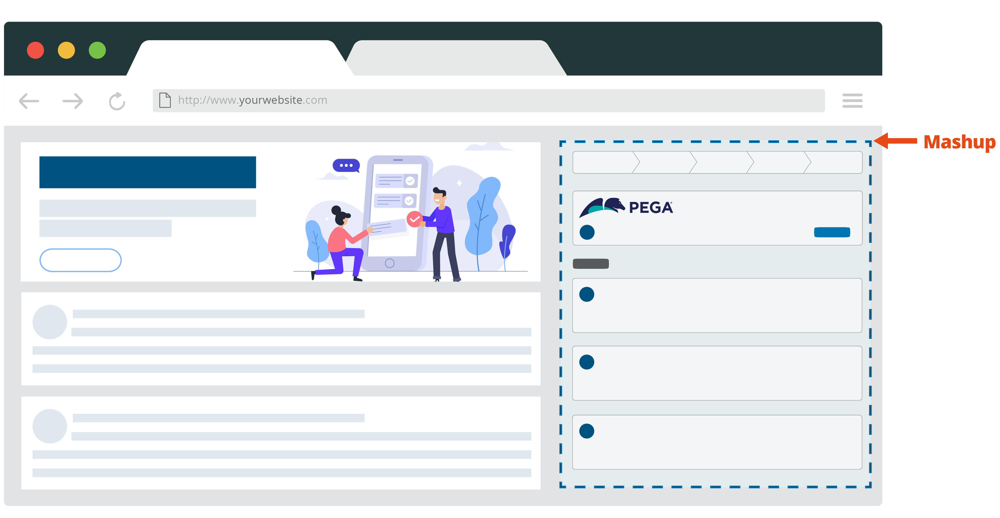

# Demo Labb self service portal

This portal application serves as a demo environment to show the use case where a client has their own self service portal for end users and wants to integrate the capabilities of Pega into their portal.

Out of the box the Pega screens are rendered using the [Constellation Design system](https://design.pega.com/). However, the [Constellation architecture](https://academy.pega.com/topic/constellation-architecture/v1) of Pega enables any frontend written in any frontend technology to be rendered. This is ideal for clients who have their own custom design system and want to integrate some functionality of Pega into their portal. Often this use case arises out of self service portals where end users can create and manage cases instead of the company employees.

The integration of Pega screens is powered by the [DX Accelerator](https://community.pega.com/marketplace/component/dx-accelerator).